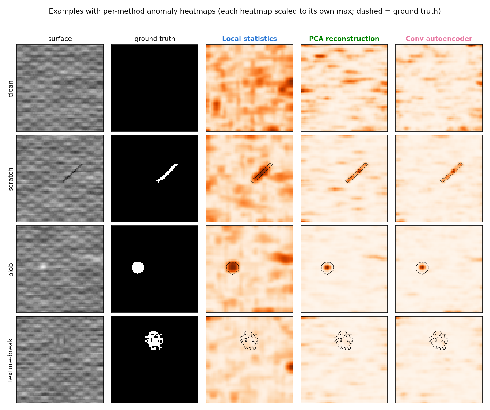
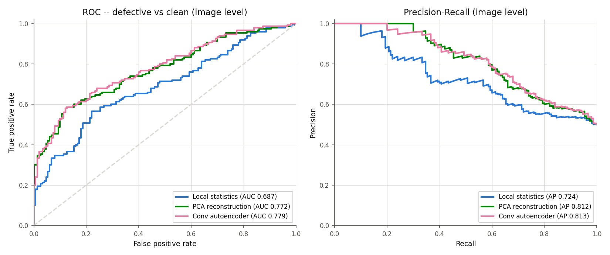
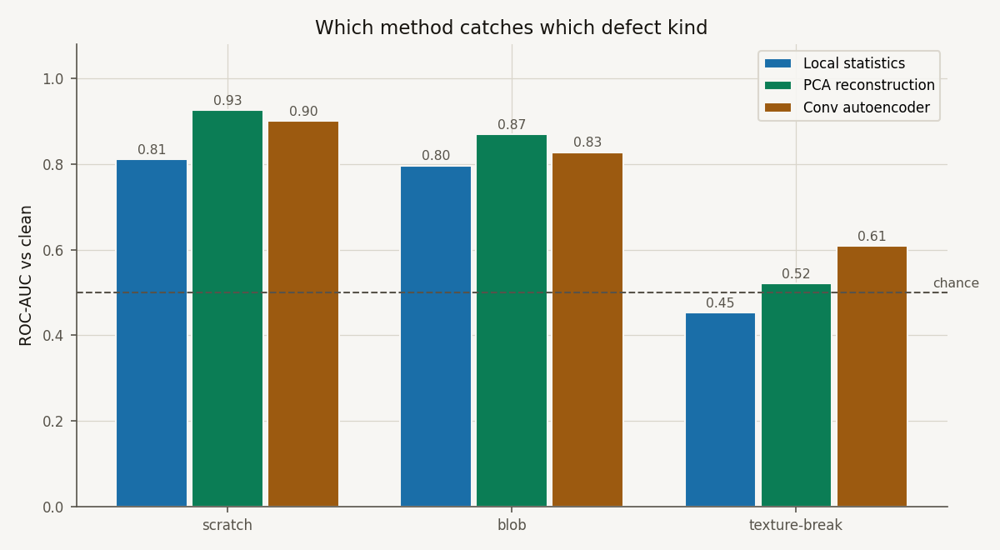

# Surface-defect screening: does a small autoencoder earn its keep?

I built this project around a question I find more interesting than "can a neural
network find defects" — namely: **at what point does the neural network actually beat
the boring methods?** The setting is a visual QA station that photographs a textured
surface (think brushed metal with a faint weave) and has to flag scratches, pits and
places where the texture pattern itself breaks.

Everything here is **synthetic and deliberately small-scale**. The images are 64x64
procedural textures I generate myself, with three defect kinds injected on top and
exact ground-truth masks saved alongside. That means the results are a *method
demonstration* — a controlled comparison under known conditions — not a claim about
any real production line. I say this up front because the honest framing is the point
of the exercise.

## The contenders

All three detectors train on **clean images only** (600 of them) and score 300 test
images (150 clean, 150 defective — 50 per defect kind). All three produce a per-pixel
heatmap, and all three use the **same** image-level scoring rule (mean of the hottest
2% of heatmap pixels), fixed before any results were looked at, so no method gets
per-method threshold tuning.

1. **Local statistics** — per-patch mean/std z-scores against the clean-texture
   distribution (`scipy.ndimage` filters, nothing learned beyond four scalars).
2. **PCA reconstruction** — pixel-space PCA via numpy SVD, 32 components; the
   heatmap is the squared residual the subspace cannot explain.
3. **Conv autoencoder** — a small PyTorch model (3 conv down / 3 conv up, 105,521
   parameters), 15 epochs of MSE on CPU, seeded; the heatmap is the squared
   reconstruction error.

ROC-AUC, PR-AUC and the localization overlap are implemented from scratch (numpy) and
tested against hand-computed values — no scikit-learn anywhere in the project.

## Measured results

One run of `python -m qav --deliverables` (seed 7, CPU). I ran the full pipeline
twice and got bit-identical numbers, so these are stable on my machine (Windows,
Python 3.14, torch 2.11):

| Method | ROC-AUC | PR-AUC | TPR @ 5% FPR | Mean IoU | Hit rate (IoU >= 0.1) |
|---|---|---|---|---|---|
| Local statistics | 0.687 | 0.724 | 0.240 | 0.170 | 0.527 |
| PCA reconstruction | 0.772 | 0.812 | **0.407** | **0.207** | **0.620** |
| Conv autoencoder | **0.779** | **0.813** | 0.393 | 0.201 | 0.547 |

Per defect type (ROC-AUC against clean / mean localization IoU):

| Method | scratch | blob | texture-break |
|---|---|---|---|
| Local statistics | 0.811 / 0.262 | 0.797 / 0.246 | 0.453 / 0.002 |
| PCA reconstruction | 0.925 / 0.416 | 0.869 / 0.174 | 0.521 / 0.032 |
| Conv autoencoder | 0.901 / 0.432 | 0.828 / 0.128 | 0.609 / 0.043 |

(For scale: random heatmaps pushed through the same localization pipeline reach mean
IoU 0.011.)







## The recommendation — decided by a rule I fixed in advance

> Rank methods by implementation complexity (local statistics < PCA reconstruction <
> conv autoencoder). Recommend the SIMPLEST method whose overall image-level ROC-AUC
> is within 0.02 of the best method's. A more complex method is recommended only when
> it beats every simpler method by more than 0.02 ROC-AUC.

The autoencoder came out best overall (0.779) — but only 0.007 ahead of PCA (0.772),
well inside the 0.02 margin. **So the recommendation is PCA reconstruction**: a
numpy SVD plus a matrix multiply, no training loop, no torch dependency, and it
actually wins on the operating point that matters for screening (TPR 0.407 vs 0.393
at 5% false alarms) and on localization. This is the third project in my portfolio
where the pre-stated rule ended up picking the simpler method over the deep one, and
I consider that a feature of the rule, not a disappointment.

## Findings I did not expect

- **Training the autoencoder longer made it worse.** At 15 epochs it scores 0.779
  overall; at 30 epochs the training loss halves (0.00275 -> 0.00142) but overall AUC
  drops to 0.738, with blob detection collapsing from 0.828 to 0.610 — the model gets
  good enough to reconstruct smooth defects too, which erases the anomaly signal.
  (Texture-breaks move the other way, 0.609 -> 0.707, because sharper texture
  reconstruction makes the broken patch stand out more.) Reconstruction loss is
  simply not the metric that matters here, and that is why I kept 15 epochs.
- **Texture-breaks are the hard class, and they split the field.** Local statistics
  are essentially blind to them (0.453 — *below* chance, because the blended patch
  slightly smooths the local variance it keys on). PCA barely notices them (0.521).
  The autoencoder is the only method meaningfully above chance (0.609). If
  texture-breaks were the defect that mattered most, the recommendation rule would
  need a per-type criterion — and the deep method would start earning its keep.
- **Nobody can localize texture-breaks.** Best mean IoU on them is 0.043 (vs 0.011
  random). Detecting "something is off in this image" and pointing at *where* are
  different problems at this defect subtlety.

## How to run it

```
pip install -r requirements.txt
python -m qav --deliverables     # full study: ~1 minute on CPU
python -m pytest                 # 15 tests, ~7 s
python -m ruff check .
```

`--deliverables` writes `deliverables/qa_defect_report.pdf` (5-page executive report
with disclaimer, gallery, curves, tables, recommendation), 
`deliverables/qa_defect_metrics.xlsx` (Metrics / PerDefectType / Assumptions /
PerImageScores — the last one has every raw score so the ROC curves can be re-derived
independently), and the three PNGs in `figures/`. Torch is only needed for the
autoencoder; without it, the classical baselines and their tests still run
(`pytest.importorskip` handles the skip). The business framing lives in
[docs/BUSINESS_CASE.md](docs/BUSINESS_CASE.md).

## Limitations, stated plainly

- **Synthetic data.** One procedural texture family, defects I designed myself, and I
  calibrated their severity so the benchmark sits in a discriminative range rather
  than at floor or ceiling. Nothing here transfers to a real line without a pilot on
  real camera data.
- **Small scale.** 600 training images, 300 test images, one seed for the headline
  numbers. This supports a method choice, not a performance guarantee.
- **No lighting, perspective or focus variation** — the classic failure modes of real
  vision systems are absent by construction.
- **The autoencoder is not tuned.** No denoising objective, no SSIM loss, no capacity
  sweep. A better AE recipe might clear the 0.02 margin; on this evidence, it did not.
- **Reproducibility:** deterministic seeds everywhere; two full runs on my machine
  were bit-identical. `torch.use_deterministic_algorithms(True, warn_only=True)` is
  requested, so across different torch builds or hardware, small float differences
  are possible.

## License

© 2026 Dimitres Kisimov — all rights reserved; published for portfolio review. See
[LICENSE](LICENSE). Third-party libraries are credited in [CREDITS.md](CREDITS.md).
