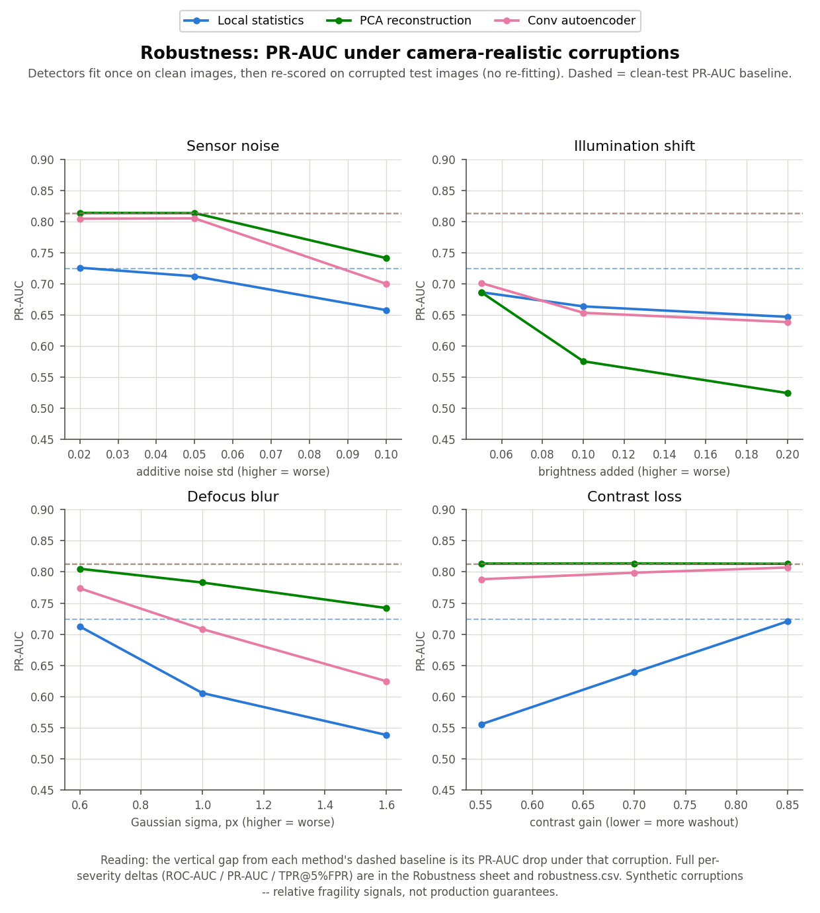
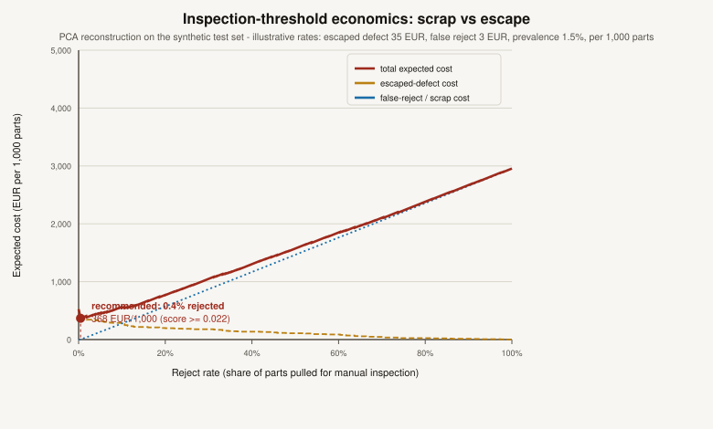
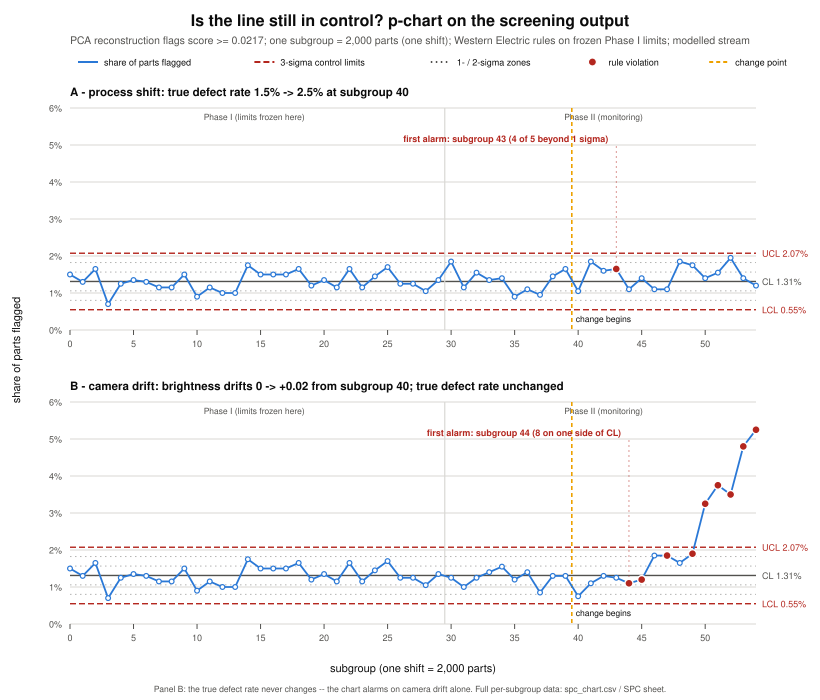

# Surface-defect screening: does a small autoencoder earn its keep?

I built this project around a question I find more interesting than "can a neural
network find defects" — namely: **at what point does the neural network actually beat
the boring methods?** The setting is a visual QA station that photographs a textured
surface (think brushed metal with a faint weave) and has to flag scratches, pits and
places where the texture pattern itself breaks.

Everything here is **synthetic and deliberately small-scale**. The images are 64x64
procedural textures I generate myself, with three defect kinds injected on top and
exact ground-truth masks saved alongside. That means the results are a *method
demonstration* — a controlled comparison under known conditions — not a claim about
any real production line. I say this up front because the honest framing is the point
of the exercise.

## The contenders

All three detectors train on **clean images only** (600 of them) and score 300 test
images (150 clean, 150 defective — 50 per defect kind). All three produce a per-pixel
heatmap, and all three use the **same** image-level scoring rule (mean of the hottest
2% of heatmap pixels), fixed before any results were looked at, so no method gets
per-method threshold tuning.

1. **Local statistics** — per-patch mean/std z-scores against the clean-texture
   distribution (`scipy.ndimage` filters, nothing learned beyond four scalars).
2. **PCA reconstruction** — pixel-space PCA via numpy SVD, 32 components; the
   heatmap is the squared residual the subspace cannot explain.
3. **Conv autoencoder** — a small PyTorch model (3 conv down / 3 conv up, 105,521
   parameters), 15 epochs of MSE on CPU, seeded; the heatmap is the squared
   reconstruction error.

ROC-AUC, PR-AUC and the localization overlap are implemented from scratch (numpy) and
tested against hand-computed values — no scikit-learn anywhere in the project.

## Measured results

One run of `python -m qav --deliverables` (seed 7, CPU). I ran the full pipeline
twice and got bit-identical numbers, so these are stable on my machine (Windows,
Python 3.14, torch 2.11):

| Method | ROC-AUC | PR-AUC | TPR @ 5% FPR | Mean IoU | Hit rate (IoU >= 0.1) |
|---|---|---|---|---|---|
| Local statistics | 0.687 | 0.724 | 0.240 | 0.170 | 0.527 |
| PCA reconstruction | 0.772 | 0.812 | **0.407** | **0.207** | **0.620** |
| Conv autoencoder | **0.779** | **0.813** | 0.393 | 0.201 | 0.547 |

Per defect type (ROC-AUC against clean / mean localization IoU):

| Method | scratch | blob | texture-break |
|---|---|---|---|
| Local statistics | 0.811 / 0.262 | 0.797 / 0.246 | 0.453 / 0.002 |
| PCA reconstruction | 0.925 / 0.416 | 0.869 / 0.174 | 0.521 / 0.032 |
| Conv autoencoder | 0.901 / 0.432 | 0.828 / 0.128 | 0.609 / 0.043 |

(For scale: random heatmaps pushed through the same localization pipeline reach mean
IoU 0.011.)


## The recommendation — decided by a rule I fixed in advance

> Rank methods by implementation complexity (local statistics < PCA reconstruction <
> conv autoencoder). Recommend the SIMPLEST method whose overall image-level ROC-AUC
> is within 0.02 of the best method's. A more complex method is recommended only when
> it beats every simpler method by more than 0.02 ROC-AUC.

The autoencoder came out best overall (0.779) — but only 0.007 ahead of PCA (0.772),
well inside the 0.02 margin. **So the recommendation is PCA reconstruction**: a
numpy SVD plus a matrix multiply, no training loop, no torch dependency, and it
actually wins on the operating point that matters for screening (TPR 0.407 vs 0.393
at 5% false alarms) and on localization. This is the third project in my portfolio
where the pre-stated rule ended up picking the simpler method over the deep one, and
I consider that a feature of the rule, not a disappointment.

## Findings I did not expect

- **Training the autoencoder longer made it worse.** At 15 epochs it scores 0.779
  overall; at 30 epochs the training loss halves (0.00275 -> 0.00142) but overall AUC
  drops to 0.738, with blob detection collapsing from 0.828 to 0.610 — the model gets
  good enough to reconstruct smooth defects too, which erases the anomaly signal.
  (Texture-breaks move the other way, 0.609 -> 0.707, because sharper texture
  reconstruction makes the broken patch stand out more.) Reconstruction loss is
  simply not the metric that matters here, and that is why I kept 15 epochs.
- **Texture-breaks are the hard class, and they split the field.** Local statistics
  are essentially blind to them (0.453 — *below* chance, because the blended patch
  slightly smooths the local variance it keys on). PCA barely notices them (0.521).
  The autoencoder is the only method meaningfully above chance (0.609). If
  texture-breaks were the defect that mattered most, the recommendation rule would
  need a per-type criterion — and the deep method would start earning its keep.
- **Nobody can localize texture-breaks.** Best mean IoU on them is 0.043 (vs 0.011
  random). Detecting "something is off in this image" and pointing at *where* are
  different problems at this defect subtlety.

## Does the winner survive a dirty camera? A robustness stress-test

The clean-data table above is measured on pristine 64x64 textures. A real line does
not stay pristine: the sensor adds noise, the lighting drifts, the focus slips, the
exposure wanders. `qav/robustness.py` measures exactly that. Each detector is fit
**once** on the clean training images (as before), then the *test* images are
corrupted with four camera-realistic perturbations and **re-scored with the
already-fitted detector — no re-training, no re-fitting**. That mirrors deployment:
a model tuned on today's clean feed meets tomorrow's degraded one. Each perturbation
is swept over three increasing severities; the headline metric is PR-AUC (defects are
the rare positive class), reported as the drop from each method's clean baseline.

The **ΔPR-AUC at the strongest severity of each corruption** (negative = degraded):

| Method | Sensor noise (std 0.10) | Illumination (+0.20) | Defocus blur (σ 1.6) | Contrast (gain 0.55) |
|---|---|---|---|---|
| Local statistics | -0.066 | -0.077 | **-0.185** | -0.168 |
| PCA reconstruction | -0.071 | **-0.288** | -0.070 | **+0.001** |
| Conv autoencoder | -0.114 | -0.175 | -0.189 | -0.025 |



The finding I did not expect, and the one that matters most for a deployment: **the
recommended method (PCA) is the *least* robust of the three to illumination drift.**
A global brightness shift of +0.20 costs PCA 0.288 PR-AUC (and 0.284 ROC-AUC) —
because PCA subtracts a *fixed* clean-training mean, a DC shift it never saw makes
every part, clean or defective, look equally anomalous, and the ranking collapses.
Yet PCA is essentially *immune* to contrast changes (it effectively re-centers each
image: +0.001 PR-AUC) and is the **most** blur-tolerant of the three (-0.070 vs
-0.185/-0.189). The two detectors that key on local texture — local statistics and
the autoencoder — collapse under defocus, which smears the very edges they rely on.

This has a concrete consequence for the recommendation. On clean data PCA and the
autoencoder tie (the pre-stated rule picks the simpler PCA). But under illumination
drift the autoencoder is markedly steadier (ROC-AUC -0.192 vs PCA's -0.284) — so if
the deployment camera's dominant risk is lighting rather than focus, the honest move
is either to **normalize brightness per image before the PCA screen**, or to revisit
the method choice. Same lesson as the texture-break finding: the "simplest good
enough" answer depends on which failure mode actually dominates your line. The full
per-severity grid (ROC-AUC / PR-AUC / TPR@5%FPR and deltas) is in the workbook's
`Robustness` sheet and `deliverables/robustness.csv`.

Honest scope: the corruptions are *synthetic stand-ins* for real camera faults; the
noise sweep uses one fixed seed; perspective and geometric distortion are still
absent. These deltas are **relative fragility signals**, not production guarantees.

## What threshold should the line run? The scrap-vs-escape economics

Detection quality is only half the decision. A screening station has to pick an
**anomaly-score threshold**: flag every part at or above it for manual inspection,
let the rest ship. Set it low and you catch more defects but scrap/re-inspect more
good parts; set it high and you save inspection effort but let more defects escape.
`qav/economics.py` sweeps that threshold across the recommended method's scores and
costs out every operating point — precision/recall, **reject rate** (share of parts
pulled for inspection = inspector workload), **escaped defects**, and an expected
cost. The true- and false-positive rates at each threshold are *measured*; the money
inputs are **illustrative, labelled constants** (not guarantees): an escaped defect
costs **35 EUR** ([A4] in the business case), a false reject **3 EUR**, and the
defect prevalence is **1.5%** ([A3]), all reported per **1,000 parts** screened.



For PCA reconstruction (the recommended method), the cost-minimising operating point
computed by the code is **score >= 0.0217**: flag ~**4.5 parts per 1,000** (reject rate
**0.45%**), catch **30% of the defects** (4.5 of ~15/1,000, so ~10.5 still escape), at
**zero false rejects** (precision 100% *at this prevalence*), for an expected
**367.50 EUR/1,000** — against **525 EUR** if you flag nothing (every defect escapes)
and **2,955 EUR** if you flag everything (the line drowns in re-inspection). The
numbers are emitted to `deliverables/cost_curve.csv` (one row per operating point) and
the workbook's `Economics` sheet.

The honest read: at a realistic 1.5% prevalence with these rates, the model earns its
keep as a **highly selective** screen. PCA separates its top ~30% of defects cleanly
from *every* clean part, so flagging just that high-confidence core removes ~30% of
escape cost at no false-alarm burden; pulling more parts isn't worth it, because the
next defects down cost more in false rejects than they save. Note this is *more*
selective than the fixed 5%-false-alarm operating point used in the ROI table of
[docs/BUSINESS_CASE.md](docs/BUSINESS_CASE.md) — at these cost rates the cost-optimal
false-alarm rate is essentially 0%. Change the three constants (one edit in
`qav/economics.py`) and the recommended threshold moves; surfacing that sensitivity is
the point.

## Is the line still in control? A p-chart on the screening output

Everything above answers a *static* question on one test set. A running station is a
*stream* — parts arrive shift after shift, and what the process engineer actually
watches is the **share of parts the screen flags per subgroup**. `qav/spc.py` builds
the textbook tool for that: a **p-chart** with control limits frozen from an
in-control Phase I, monitored with the four classic **Western Electric run rules**
(one point beyond 3σ; 2 of 3 beyond 2σ on one side; 4 of 5 beyond 1σ on one side;
8 consecutive on one side of the center line).

What is measured and what is modelled here — this layer is both, and the split is the
point. The per-class flag probabilities are **measured**: a fresh calibration set
(1,000 clean + 600 defective synthetic parts, its own seed, never seen by the study)
is scored by the already-fitted PCA screen at the cost-optimal threshold from the
economics section — no re-fitting anywhere. The stream itself is **modelled**: i.i.d.
seeded draws at the labelled 1.5% prevalence [A3], in subgroups of 2,000 parts = one
shift's production [A1]. Calibration produced its own honest finding first: **the
"zero false rejects" of the cost-optimal threshold does not survive fresh parts.** On
the 150 clean test images the threshold flags none; on 1,000 fresh clean parts it
flags 7 (**0.70%**) — the test-set zero was measurement resolution, not a property of
the threshold. (Fresh defectives: 35.7% flagged, vs 30.0% on the 150-image test set —
same story, more resolution.)

Phase I (30 modelled in-control shifts) freezes the limits: **center line 1.31%,
UCL 2.07%** (= 41 flags per 2,000), **LCL 0.55%**. Then two things go wrong, each in
its own Phase II scenario against those same frozen limits:



- **A — the process shifts.** True defect rate steps 1.5% → 2.5% at subgroup 40. The
  chart catches it at subgroup 43 — by **4 of 5 beyond 1σ**, a run rule. The naked 3σ
  rule **never fires** in the entire 15-subgroup monitored window: a two-thirds rise
  in defect rate hides inside the control band, which is exactly why the run rules
  exist. While it ran undetected, each shift shipped ~13 extra escaped defects
  (~450 EUR per shift at the illustrative 35 EUR [A4]).
- **B — the camera drifts.** True defect rate **never changes**; the brightness
  drifts 0 → +0.02 (two percent of full scale — invisible to the eye) over 15
  subgroups, with the flag rates re-measured on the calibration set at every step of
  the ramp. The chart alarms anyway — first by **8 on one side of CL** at subgroup
  44, with 3σ only confirming at 50 — because a p-chart on detector output monitors
  the *process and the measurement system together*. This is the robustness finding
  (PCA is the method most fragile to illumination drift) surfacing exactly where a
  plant would meet it: an out-of-control signal means **investigate** — check the
  camera before blaming the line.

Honest scope, stated plainly: the stream is a modelled stand-in (real lines
autocorrelate; i.i.d. draws do not), the detection delays above are one seeded run of
the chart mechanics, not an average-run-length study, and the Western Electric rules
buy their sensitivity with more false alarms (in-control ARL ≈ 92 subgroups combined
vs ≈ 370 for 3σ alone — on a real line, roughly one false investigation per couple of
months at this subgroup rate). The simulation seed is fixed to a value whose Phase I
passes its own in-control check — the premise chart practice requires before freezing
limits — and the code counts and reports alarms wherever they occur, including before
the injected change (this run: zero). Every subgroup, rate, limit and rule verdict is
in `deliverables/spc_chart.csv` and the workbook's `SPC` sheet.

## How to run it

```
pip install -r requirements.txt
python -m qav --deliverables     # full study + cost curve + robustness + SPC: ~2 minutes on CPU
python -m pytest                 # 45 tests, ~30 s
python -m ruff check .
```

`--deliverables` writes `deliverables/qa_defect_report.pdf` (8-page executive report
with disclaimer, gallery, curves, tables, recommendation, the cost curve, the
robustness stress-test and the control chart), `deliverables/qa_defect_metrics.xlsx`
(Metrics / PerDefectType / Economics / Robustness / SPC / Assumptions /
PerImageScores — PerImageScores has every raw score so the ROC curves can be
re-derived independently), `deliverables/cost_curve.csv`,
`deliverables/robustness.csv`, `deliverables/spc_chart.csv` plus the hand-drawn
`figures/cost_curve.svg` and `figures/spc_chart.svg`, and the four PNGs in
`figures/`. Torch is only needed for the autoencoder; without it, the classical
baselines, the economics, robustness and SPC layers and their tests still run
(`pytest.importorskip` handles the skip). The business framing lives in
[docs/BUSINESS_CASE.md](docs/BUSINESS_CASE.md).

## Limitations, stated plainly

- **Synthetic data.** One procedural texture family, defects I designed myself, and I
  calibrated their severity so the benchmark sits in a discriminative range rather
  than at floor or ceiling. Nothing here transfers to a real line without a pilot on
  real camera data.
- **Small scale.** 600 training images, 300 test images, one seed for the headline
  numbers. This supports a method choice, not a performance guarantee.
- **No perspective or geometric variation** — those classic failure modes of real
  vision systems are absent by construction. Lighting, focus, contrast and sensor
  noise *are* now probed synthetically by the robustness stress-test above, but only
  as post-hoc corruptions of the synthetic textures, not real camera degradation.
- **The autoencoder is not tuned.** No denoising objective, no SSIM loss, no capacity
  sweep. A better AE recipe might clear the 0.02 margin; on this evidence, it did not.
- **The SPC stream is modelled, not measured.** Its per-class flag rates are measured
  on synthetic calibration parts, but the part-to-part stream is i.i.d. seeded draws;
  real production autocorrelates, drifts and batches in ways that change both the
  false-alarm rate and the detection delay. One seeded run of the chart, not an
  average-run-length study.
- **Reproducibility:** deterministic seeds everywhere; two full runs on my machine
  were bit-identical. `torch.use_deterministic_algorithms(True, warn_only=True)` is
  requested, so across different torch builds or hardware, small float differences
  are possible.

## License

© 2026 Dimitres Kisimov — all rights reserved; published for portfolio review. See
[LICENSE](LICENSE). Third-party libraries are credited in [CREDITS.md](CREDITS.md).
